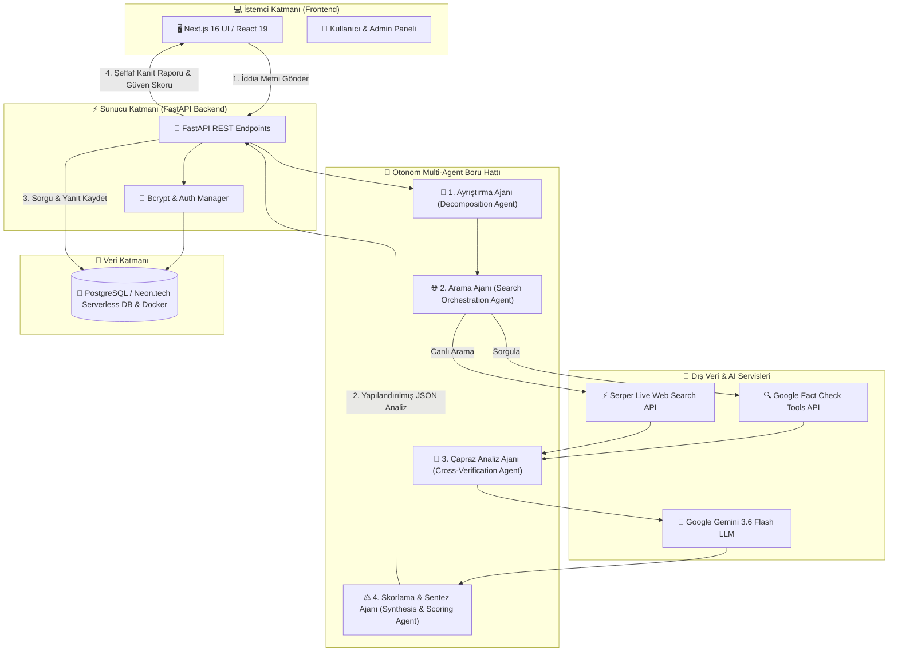
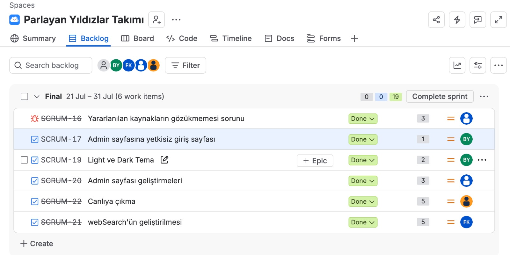
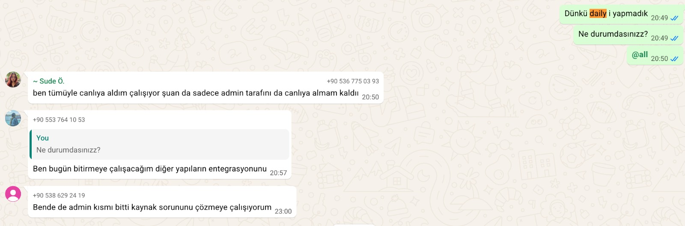

# 🔍 Fact-Check AI

<div align="center">


**Şüpheli haberleri, sosyal medya paylaşımlarını ve iddiaları otonom yapay zeka ajanlarıyla saniyeler içinde analiz eden gerçek zamanlı doğrulama platformu.**

[](https://buketyurt.atlassian.net/jira/software/projects/SCRUM/boards/1/backlog)
[](https://youtu.be/3YMe8Pitcwo)

---

### 👥 Ekip Üyeleri (Parlayan Yıldızlar Takımı)

<table>
  <tr>
    <td align="center" width="160">
      <a href="https://github.com/aysesudeozden">
        <br />
        <sub><b>Ayşe Sude Özden</b></sub>
      </a><br />
      <small>Product Owner / Dev</small>
    </td>
    <td align="center" width="160">
      <a href="https://github.com/buketyurt">
        <br />
        <sub><b>Buket Yurt</b></sub>
      </a><br />
      <small>Scrum Master / Dev</small>
    </td>
    <td align="center" width="160">
      <a href="https://github.com/sedefulker">
        <br />
        <sub><b>Sedef Ülker</b></sub>
      </a><br />
      <small>Developer</small>
    </td>
    <td align="center" width="160">
      <a href="https://github.com/Floemsyza">
        <br />
        <sub><b>Feyza İrem Kart</b></sub>
      </a><br />
      <small>Developer</small>
    </td>
  </tr>
</table>

</div>

---

# 📌 Ürün İle İlgili Bilgiler

| 🏷️ Takım İsmi | 💡 Ürün İsmi | 🧠 Ajan Mimarisi |
| :---: | :---: | :---: |
| **Parlayan Yıldızlar Takımı** | **Fact-Check AI** | **Gemini 3.6 Multi-Agent** |

---

### 📝 Ürün Açıklaması ve Çalışma Mantığı

**Fact-Check AI**, şüpheli haberleri, sosyal medya paylaşımlarını ve iddiaları otonom yapay zeka ajanlarıyla saniyeler içinde analiz eden gerçek zamanlı bir doğrulama (**fact-checking**) uygulamasıdır.

```
📥 1. Metin Girdisi ──► 🧩 2. Alt İddia Ayrıştırması ──► 🌐 3. Canlı Web Taraması ──► ⚖️ 4. Güven Skoru & Raporlama
```

- 🧩 **1. Alt İddia Ayrıştırması (Ayrıştırma Ajanı):** Kullanıcının girdiği karmaşık metin, kontrol edilebilir atomik iddialara ayrıştırılır.
- 🌐 **2. Canlı Teyit Taraması (Arama Ajanı):** Google Fact Check API ve Serper API entegrasyonuyla canlı web ve teyit veritabanları taranır.
- 🔬 **3. Çapraz Kanıt Analizi (Karşılaştırma Ajanı):** Elde edilen internet bulguları ile iddialar anlamsal ve olgusal çapraz teste tabi tutulur.
- ⚖️ **4. Güven Skoru & Raporlama (Skorlama Ajanı):** Nihai güven skoru (0-100), yönetici özeti ve tıklanabilir doğrulama kaynakları (**grounding links**) şeffaf biçimde sunulur.

---

## 📐 Sistem ve Multi-Agent Mimari Akışı



---

## ✨ Öne Çıkan Ürün Özellikleri

<table width="100%">
  <tr>
    <td width="50%" valign="top">
      <h3>🤖 Otonom Ajan & Analiz Yetenekleri</h3>
      <ul>
        <li>🧩 <b>Atomik Alt İddia Ayrıştırması:</b> Girdi metni, <i>Decomposition Agent</i> tarafından anlamsal parçalara ayrılarak her iddia bağımsız teste tabi tutulur.</li>
        <li>🌐 <b>Canlı Teyit & Web Arama:</b> <i>Search Orchestration Agent</i>, Google Fact Check Tools API ve Serper API ile canlı internet taraması yapar.</li>
        <li>🔬 <b>Çapraz Kanıt Analizi:</b> <i>Cross-Verification Agent</i>, web bulgularını iddialarla anlamsal ve mantıksal olarak karşılaştırır.</li>
        <li>⚖️ <b>Sentez & Güven Skoru (0-100):</b> <i>Scoring Agent</i>, tüm bulguları sentezleyerek güven skoru, yönetici özeti ve kanıt raporu üretir.</li>
      </ul>
    </td>
    <td width="50%" valign="top">
      <h3>⚡ Platform, Güvenlik & Kullanıcı Deneyimi</h3>
      <ul>
        <li>📊 <b>Şeffaf Grounding Bağlantıları:</b> Analiz çıktısında tüm iddiaların dayandırıldığı doğrudan web doğrulama kaynakları listelenir.</li>
        <li>🔐 <b>Güvenli Kullanıcı Yönetimi:</b> Bcrypt şifreleme ile e-posta/şifre tabanlı yetkilendirme ve güvenli oturum yönetimi.</li>
        <li>📜 <b>Analiz Geçmişi & Veri Kaydı:</b> Yapılan araştırmaların Neon.tech Cloud PostgreSQL veritabanına kaydedilmesi ve kullanıcı detay ekranı.</li>
        <li>⚙️ <b>Yönetim Paneli (Admin Console):</b> Yöneticiler için canlı sistem logları, kullanıcı sorguları izleme ve yetkilendirme paneli.</li>
      </ul>
    </td>
  </tr>
</table>

<div align="center">


</div>

---

## 🎯 Hedef Kitle

- 📱 **Sosyal Medya Kullanıcıları:** Günlük haber akışındaki bilgi kirliliğini ve dezenformasyonu teyit etmek isteyenler.
- 📰 **Gazeteciler ve İçerik Üreticileri:** Haberlerini yayınlamadan önce hızlı fakt-kontrolü yapmak isteyen profesyoneller.
- 🎓 **Öğrenciler ve Akademisyenler:** Araştırmalarında doğrulanmış kaynaklara hızlıca ulaşmak isteyenler.
- 🌐 **Doğru Bilgiye Hızlı Ulaşmak İsteyen Herkes:** 15-65 yaş arası tüm dijital okuryazarlar.

---

## 💻 Teknoloji Yığını (Tech Stack)

| Katman | Teknolojiler & Rozetler |
| :--- | :--- |
| **Frontend** |     |
| **Backend** |     |
| **Yapay Zeka** |   |
| **Veritabanı & Cloud** |    |
| **Veri & Teyit API'leri** |   |
| **Proje Yönetimi** |    |

---

## 🚀 Geliştirme ve Canlıya Alma Süreci (Deployment Lifecycle)

- 🐳 **Yerel Geliştirme (Local Development):** Projenin ilk aşamalarında PostgreSQL veritabanı ve bağımlılıklar **Docker & Docker Compose** ile konteynerize edilerek yerel ortamda izolasyon sağlandı ve geliştirme süreçleri yürütüldü.
- ☁️ **Canlıya Alma (Production Deployment):** Ürün canlıya alınırken yüksek erişilebilirlik ve kesintisiz bulut entegrasyonu amacıyla veritabanı **Neon.tech Serverless PostgreSQL** mimarisine taşındı, uygulama servisleri canlı ortama başarıyla yaygınlaştırıldı.

---

## 🔗 Product Backlog URL & Tanıtım Videosu

- 📋 **Product Backlog URL:** [](https://buketyurt.atlassian.net/jira/software/projects/SCRUM/boards/1/backlog)
- 🎬 **Ürün Tanıtım Videosu:** [](https://youtu.be/3YMe8Pitcwo)

---

# Sprint 1

- **Sprint Notları**: Sprint adı "İlk Elin Günahı Olmaz :)" olarak belirlenmiş olup 26 Haziran – 5 Temmuz 2026 tarihleri arasında yürütülmüştür. Sprint hedefi; WebSearch tool'unun belirlenmesi, login sayfası ve arayüz sayfası UI'larının geliştirilmesi, proje mimarisinin ve akışının çıkarılmasıdır.

- **Sprint içinde tamamlanması tahmin edilen puan**: 11 puan

- **Puan tamamlama mantığı**: Sprint'e alınan her story, iş yüküne göre puanlanmıştır: Mimari tasarım dökümanı (SCRUM-1: 3 puan), Login Sayfası (SCRUM-2: 2 puan), Arayüz Sayfası (SCRUM-3: 3 puan), Web search/grounding API araştırması (SCRUM-4: 3 puan). İlk sprint olduğu için ekip hızı (velocity) referansı bulunmadığından toplam 11 puanlık tahminle başlanmıştır.

- **Backlog düzeni ve Story seçimleri**: Backlog, ilk yapılacak story'lere göre düzenlenmiştir. Sprint 1'e ürünün temelini oluşturan mimari tasarım, login/arayüz UI geliştirmeleri ve web search araştırması alınmış; bu işlerin çıktısına bağımlı olan story'ler (SCRUM-5: Login sayfası ile arayüz sayfasının birleştirilmesi, SCRUM-6: Database bağlanması, SCRUM-7: Web tool'un arayüze entegrasyonu) sonraki sprint'ler için backlog'da bekletilmiştir.

  

- **Daily Scrum**: Daily Scrum toplantıları, ekip üyelerinin farklı zaman planlamaları sebebiyle WhatsApp üzerinden asenkron olarak yürütülmüştür. Sprint boyunca 30.06.2026 ve 02.07.2026 tarihlerinde iki daily yapılmış, üyeler yaptıkları işleri ve sonraki adımlarını paylaşmıştır. Daily Scrum ekran görüntüleri Word dosyası olarak da tarafımızdan paylaşılmaktadır: [YZTA Sprint Log](YZTA%20Sprint%20Log.docx)

  **Daily 1**

  

  **Daily2**
  
  
  

- **Sprint board update**: Sprint board ekran görüntüleri:

  Sprint devam ederken:

  

  Sprint sonu:

  

- **Ürün Durumu**: Ekran görüntüleri:

  Login sayfası:

  

  Ana sayfa (iddia analiz ekranı):

  

- **Sprint Review**: Sprint sonunda planlanan 11 puanın 8'i tamamlanmıştır. Login Sayfası (SCRUM-2: 2 puan), Arayüz Sayfası (SCRUM-3: 3 puan) ve Web search/grounding API araştırması (SCRUM-4: 3 puan) Done durumuna alınmış; ürünün login sayfası ile ana sayfası (iddia analiz ekranı) çalışır ve demoya hazır duruma getirilmiştir. Mimari tasarım dökümanı (SCRUM-1: 3 puan) sprint içinde tamamlanamamış olup bir sonraki sprint'e devredilmiştir. Bir sonraki sprint planlamasında bu iş; backlog'da bekleyen login ile arayüz sayfasının birleştirilmesi (SCRUM-5), database bağlanması (SCRUM-6) ve web tool'un arayüze entegrasyonu (SCRUM-7) story'leriyle birlikte ele alınacaktır. Sprint Review katılımcıları: Buket Yurt, Sude Özden., Sedef Ülker, Feyza İrem Kart. 

- **Sprint Retrospective**:
  - Daily Scrum'ların WhatsApp üzerinden asenkron yürütülmesinin ekibe uyduğuna ve devam etmesine karar verilmiştir.
  - UI değişikliklerinin commit'lenmeden önce takımla paylaşılıp geri bildirim alınması yaklaşımı benimsenmiştir.
  - Sprint'te tamamlanamayan mimari tasarım dökümanının puan tahmini gözden geçirilmeli ve sonraki sprint planlamasında ekip hızı dikkate alınmalıdır.
  - Bir sonraki sprint'te login ile arayüz sayfasının birleştirilmesine, database bağlantısına ve web tool entegrasyonuna öncelik verilecektir.

---

# Sprint 2

- **Sprint Notları**: Sprint 2, Sprint 1'in kapanışının ardından yürütülmüş ve ürünün uçtan uca çalışır hale getirilmesine odaklanmıştır. <!-- sprint adı ve tarih aralığını Jira'dan ekleyin --> Sprint hedefi; Sprint 1'den devreden mimari tasarım dökümanının tamamlanması, login sayfası ile arayüzün birleştirilip backend'e bağlanması, database kurulumu, register sayfası, web tool'un arayüze entegrasyonu ile logging altyapısının kurulmasıdır.

- **Sprint içinde tamamlanması tahmin edilen puan**: 21+ puan <!-- board görsellerinde görünmeyen 2 iş kaleminin puanlarıyla birlikte toplamı Jira'dan teyit edin -->

- **Puan tamamlama mantığı**: Sprint 1'den devreden iş ile ona bağımlı entegrasyon story'leri birlikte ele alınmıştır: Mimari tasarım dökümanı (SCRUM-1: 3 puan, devir), Login sayfası ile arayüz sayfasının birleştirilmesi (SCRUM-5: 1 puan), Database bağlanması (SCRUM-6: 3 puan), Web tool'un arayüze entegrasyonu (SCRUM-7: 5 puan), Login sayfasının backend'inin tamamlanması (SCRUM-8: 2 puan), Logging (SCRUM-10: 3 puan), Arayüzde sorulan soruların tablolarının mimarisi (SCRUM-11: 1 puan), Register sayfası (SCRUM-13: 3 puan). <!-- board'da görünmeyen 2 iş kalemini (numara, başlık, puan) buraya ekleyin -->

- **Backlog düzeni ve Story seçimleri**: Sprint 1 sonunda backlog'da bekletilen ve UI çıktıları hazır olduğu için önü açılan entegrasyon story'leri (SCRUM-5, SCRUM-6, SCRUM-7) Sprint 2'ye alınmış; bunlara kullanıcı yönetimini tamamlayan login backend'i ve register sayfası ile veri katmanı ve izlenebilirlik işleri (tablo mimarisi, logging) eklenmiştir.

- **Daily Scrum**: Daily Scrum toplantıları WhatsApp üzerinden asenkron yürütülmeye devam etmiştir. Sprint boyunca iki daily yapılmış; üyeler login/register'ın tamamlanması, PostgreSQL + Docker ile users, fact_check ve chats tablolarının oluşturulması, Gemini API ile soru-cevap akışının veritabanına kaydedilmesi, geçmiş analizler sayfası, logging ve admin tarafı ile Fact Check API kararı hakkında ilerlemelerini paylaşmıştır:

  **Daily 1**

  
  

  **Daily 2**

  

- **Sprint board update**: Sprint board ekran görüntüleri:

  Sprint devam ederken:

  

  Sprint sonu:

  

- **Ürün Durumu**: Ekran görüntüleri:

  Analiz sonucu ekranı (nihai karar, güven endeksi, doğrulama özeti ve kanıt analizi):

  

  Analiz sırasında ajan adımlarının canlı takibi (ayrıştırma, arama orkestrasyonu, çapraz doğrulama, sentez ve skorlama):

  

  Analiz Geçmişi sayfası (geçmiş doğrulama süreçleri ve raporları):

  

  Sprint içinde geliştirilen ilk sürümden geçmiş sayfası (Sohbet ve Araştırma Geçmişi — liste ve detay görünümü):

  
  

- **Sprint Review**: Sprint'e alınan iş kalemlerinin tamamı sprint sonunda Done durumuna alınmıştır. Sprint 1'den devreden mimari tasarım dökümanı tamamlanmış; login sayfası arayüzle birleştirilip backend'i yazılmış, register sayfası ile kullanıcı ekleme akışı kurulmuş ve bir admin kullanıcısı tanımlanmıştır. PostgreSQL + Docker ile database bağlanmış (users, fact_check, chats tabloları), arayüzde sorulan soruların tablo mimarisi kurulmuş ve Gemini API üzerinden soru-cevap akışı veritabanına kaydedilir hale getirilmiştir. Web tool olarak başlangıç için Fact Check API kullanımına karar verilmiş ve arayüze entegrasyonu ile logging altyapısı tamamlanmıştır. Geçmiş analizlerin görüntülenebildiği "Sohbet ve Araştırma Geçmişi" sayfası eklenmiştir. Canlıya alma (deployment) seçenekleri araştırılmaya başlanmış olup bir sonraki sprint'te ele alınacaktır. Sprint Review katılımcıları: Buket Yurt, Sude Özden, Sedef Ülker, Feyza İrem Kart.

- **Sprint Retrospective**:
  - Sprint'e birbirini bloklayan task'ların birlikte alınması nedeniyle sprint içinde bloklanmalar yaşanmıştır; sonraki sprint planlamalarında birbirine bağımlı task'ların aynı sprint'e alınmamasına veya sıralamasının buna göre planlanmasına dikkat edilmesine karar verilmiştir.
  - WhatsApp üzerinden asenkron daily formatının ekip için verimli olduğu teyit edilmiş ve sürdürülmesine karar verilmiştir.
  - Üyelerin işleri bittikçe diğer ekip arkadaşlarına destek için hazır beklemesi (ör. database tarafında) iyi işlemiştir; bu yaklaşım devam ettirilecektir.
  - Sprint kapanışlarının ekipçe değerlendirilebilmesi için sprint raporu hazırlanması kararlaştırılmıştır.
  - Bir sonraki sprint'te ürünün canlıya alınmasına (deployment) ve arayüz tasarım iyileştirmelerine öncelik verilecektir.

---

# Sprint 3

- **Sprint Notları**: Sprint adı "Final" olarak belirlenmiş olup 21 Temmuz – 31 Temmuz 2026 tarihleri arasında yürütülmüştür. Sprint hedefi; ürünün canlıya alınması, admin sayfasının yetkilendirme ve geliştirmelerinin tamamlanması, web search altyapısının geliştirilmesi, light/dark tema desteğinin eklenmesi ve kaynakların analiz sonuçlarında görüntülenmemesi sorununun giderilmesidir.

- **Sprint içinde tamamlanması tahmin edilen puan**: 19 puan

- **Puan tamamlama mantığı**: Yararlanılan kaynakların gözükmemesi sorunu (SCRUM-16: 3 puan), Admin sayfasına yetkisiz giriş sayfası (SCRUM-17: 1 puan), Light ve Dark Tema (SCRUM-19: 2 puan), Admin sayfası geliştirmeleri (SCRUM-20: 3 puan), webSearch'ün geliştirilmesi (SCRUM-21: 5 puan), Canlıya çıkma (SCRUM-22: 5 puan).

- **Backlog düzeni ve Story seçimleri**: Sprint 2'de altyapısı tamamlanan ürünün son sprintinde; ürünün canlıya alınması (deployment) ve arayüz tasarım iyileştirmeleri önceliklendirilmiştir. Bu doğrultuda admin tarafının yetkilendirilmesi ve geliştirilmesi, light/dark tema desteği, web search geliştirmesi ve kaynak görüntüleme hatasının giderilmesi Sprint 3'e alınmıştır.

  

- **Daily Scrum**: Daily Scrum toplantıları WhatsApp üzerinden asenkron olarak yürütülmeye devam etmiştir. Sprint boyunca 1 daily yapılmış olup ekip üyeleri; ürünün tamamının canlıya alındığını, admin tarafının canlıya alma sürecinin devam ettiğini, diğer yapıların entegrasyonu ile admin kısmının tamamlandığını ve kaynak sorununun çözülmeye çalışıldığını paylaşmıştır. Ekip, sprint boyunca sürekli birlikte ilerlediği ve her gün düzenli olarak iletişimde kaldığı için görev durumlarından birbirinden haberdar olmuştur.

  

- **Sprint board update**: Sprint sonunda tüm iş kalemleri Done durumuna alınmıştır:

  

- **Sprint Review**: Sprint'e alınan 19 puanlık iş kaleminin tamamı başarıyla tamamlanmıştır. Yararlanılan kaynakların analiz sonuçlarında gözükmemesi sorunu giderilmiş (SCRUM-16), admin sayfasına yetkisiz erişimi engelleyen giriş kontrolü eklenmiş (SCRUM-17) ve admin sayfası geliştirmeleri tamamlanmıştır (SCRUM-20). Kullanıcı deneyimini iyileştirmek amacıyla light ve dark tema desteği eklenmiş (SCRUM-19), web search altyapısı geliştirilmiş (SCRUM-21) ve ürün canlı ortama alınmıştır (SCRUM-22). Sprint Review katılımcıları: Buket Yurt, Sude Özden, Sedef Ülker, Feyza İrem Kart.

- **Sprint Retrospective**:
  - Ekibin sürekli birlikte çalışması ve gün içinde düzenli iletişim kurması sayesinde tek bir daily yapılmasına rağmen görev durumlarından herkesin haberdar olduğu görülmüş; bu iletişim tarzının verimli olduğuna karar verilmiştir.
  - Canlıya alma sürecinin (deployment) parça parça değil ürünün tüm bileşenleri (admin dahil) için birlikte planlanmasının sonraki projelerde daha verimli olacağı değerlendirilmiştir.
  - Bootcamp kapsamındaki son sprint olması nedeniyle, tüm sprintlerde alınan story'lerin başarıyla tamamlanmış olması ekip tarafından olumlu değerlendirilmiştir.
