# Takım İsmi

Parlayan Yıldızlar Takımı

# Ürün İle İlgili Bilgiler

## Takım Elemanları

- Buket Yurt: Team Member/Developer <!-- rolünüzü güncelleyin (Product Owner / Scrum Master / Developer) -->
- Sude Ö.: Team Member/Developer <!-- ad-soyad ve rolü güncelleyin -->
- Sedef: Team Member/Developer <!-- ad-soyad ve rolü güncelleyin -->
- Feyza İrem: Team Member/Developer <!-- ad-soyad ve rolü güncelleyin -->

## Ürün İsmi

Doğrulama Asistanı

## Ürün Açıklaması

Doğrulama Asistanı, şüpheli haberleri, sosyal medya paylaşımlarını ve iddiaları
otonom yapay zeka ajanlarıyla saniyeler içinde analiz eden gerçek zamanlı bir
doğrulama (fact-checking) uygulamasıdır. Kullanıcının girdiği metin,
multi-agent mimarisiyle kontrol edilebilir alt iddialara ayrıştırılır; canlı
web ve bilimsel veritabanları taranarak bulgular iddialarla çapraz analize
tabi tutulur ve nihai güven skoru, yönetici özeti ile kanıt raporu halinde
kullanıcıya sunulur. Tüm sonuçlar, doğrulama kaynaklarına (grounding links)
bağlantılarla birlikte şeffaf biçimde raporlanır.

## Ürün Özellikleri

- Metni kontrol edilebilir alt iddialara bölme (Ayrıştırma Ajanı)
- Canlı web ve bilimsel veritabanlarında tarama (Arama Ajanı)
- Bulgular ile iddiaların çapraz analizi (Karşılaştırma Ajanı)
- Nihai güven skoru ve kanıt raporu sentezi (Skorlama Ajanı)
- İddia kırılımları, yönetici özeti ve doğrulama kaynakları (grounding links) içeren sonuç ekranı
- E-posta/şifre ile giriş; Google ve GitHub ile devam etme seçenekleri
- Eski araştırmalara belli bir süre içinde tekrar ulaşabilme 

## Hedef Kitle

- Sosyal medya kullanıcıları
- Gazeteciler ve içerik üreticileri
- Öğrenciler ve akademisyenler
- Doğru bilgiye hızlı ulaşmak isteyen 15-65 yaş arası tüm internet kullanıcıları

## Product Backlog URL

[Jira Backlog Board](https://buketyurt.atlassian.net/jira/software/projects/SCRUM/boards/1/backlog)

---

# Sprint 1

- **Sprint Notları**: Sprint adı "İlk Elin Günahı Olmaz :)" olarak belirlenmiş olup 26 Haziran – 5 Temmuz 2026 tarihleri arasında yürütülmüştür. Sprint hedefi; WebSearch tool'unun belirlenmesi, login sayfası ve arayüz sayfası UI'larının geliştirilmesi, proje mimarisinin ve akışının çıkarılmasıdır.

- **Sprint içinde tamamlanması tahmin edilen puan**: 11 puan

- **Puan tamamlama mantığı**: Sprint'e alınan her story, iş yüküne göre puanlanmıştır: Mimari tasarım dökümanı (SCRUM-1: 3 puan), Login Sayfası (SCRUM-2: 2 puan), Arayüz Sayfası (SCRUM-3: 3 puan), Web search/grounding API araştırması (SCRUM-4: 3 puan). İlk sprint olduğu için ekip hızı (velocity) referansı bulunmadığından toplam 11 puanlık tahminle başlanmıştır.

- **Backlog düzeni ve Story seçimleri**: Backlog, ilk yapılacak story'lere göre düzenlenmiştir. Sprint 1'e ürünün temelini oluşturan mimari tasarım, login/arayüz UI geliştirmeleri ve web search araştırması alınmış; bu işlerin çıktısına bağımlı olan story'ler (SCRUM-5: Login sayfası ile arayüz sayfasının birleştirilmesi, SCRUM-6: Database bağlanması, SCRUM-7: Web tool'un arayüze entegrasyonu) sonraki sprint'ler için backlog'da bekletilmiştir.

  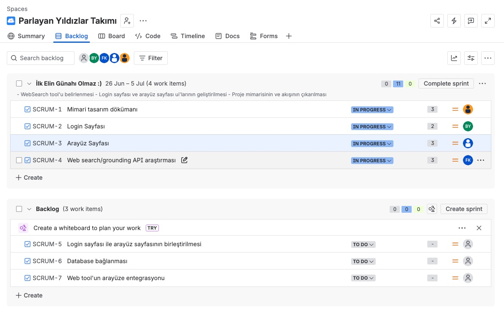

- **Daily Scrum**: Daily Scrum toplantıları, ekip üyelerinin farklı zaman planlamaları sebebiyle WhatsApp üzerinden asenkron olarak yürütülmüştür. Sprint boyunca 30.06.2026 ve 02.07.2026 tarihlerinde iki daily yapılmış, üyeler yaptıkları işleri ve sonraki adımlarını paylaşmıştır. Daily Scrum ekran görüntüleri Word dosyası olarak da tarafımızdan paylaşılmaktadır: [YZTA Sprint Log](YZTA%20Sprint%20Log.docx)

  **Daily 1**

  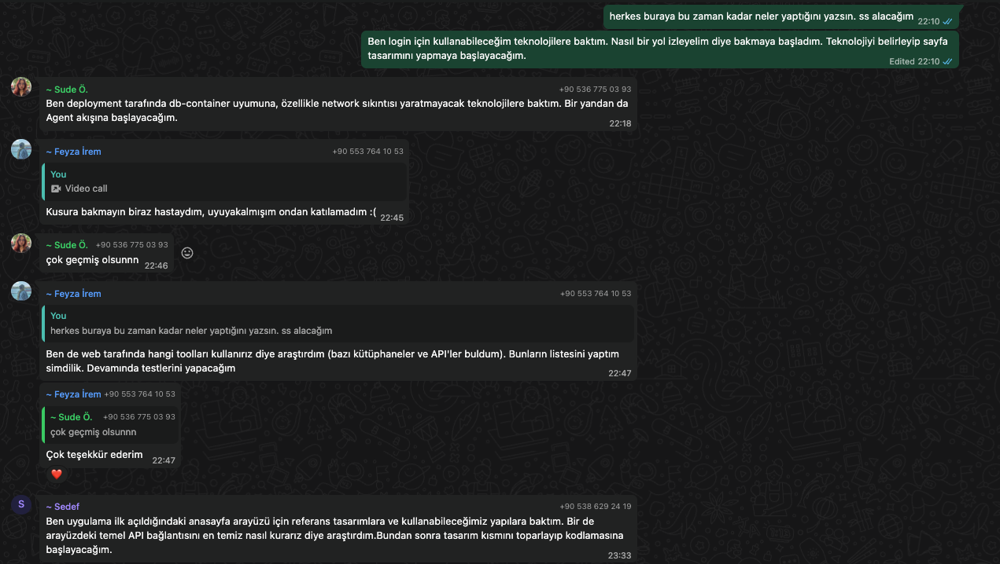

  **Daily2**
  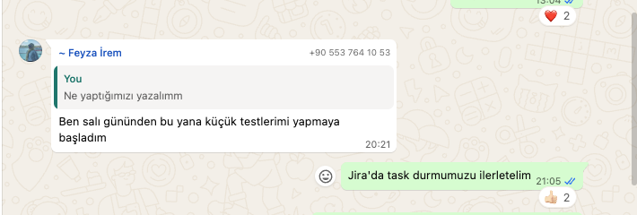
  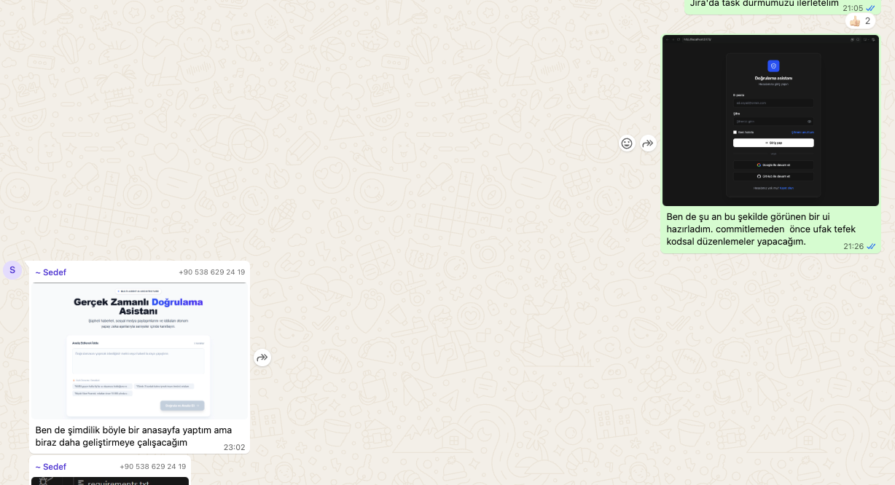
  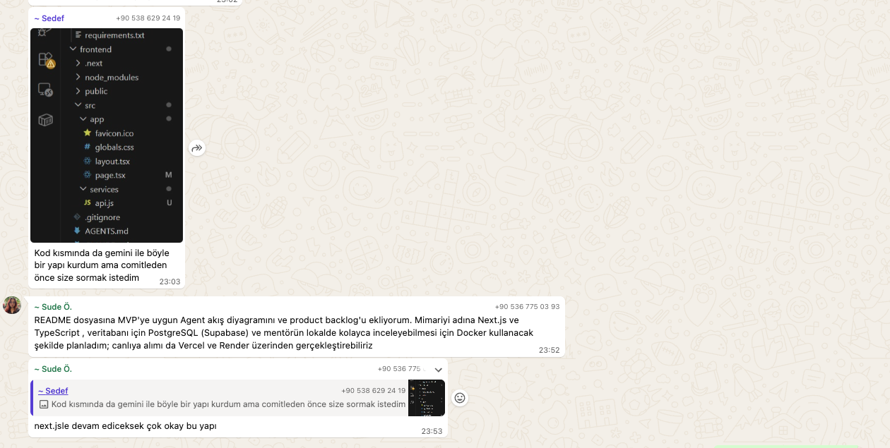

- **Sprint board update**: Sprint board ekran görüntüleri:

  Sprint devam ederken:

  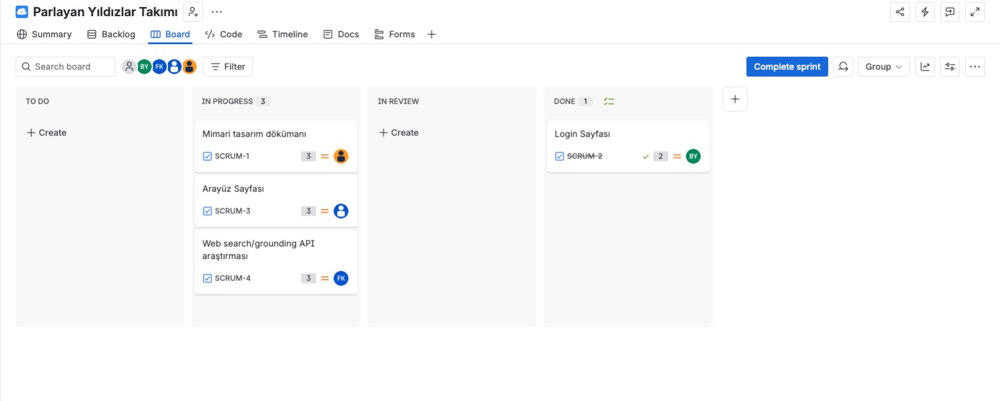

  Sprint sonu:

  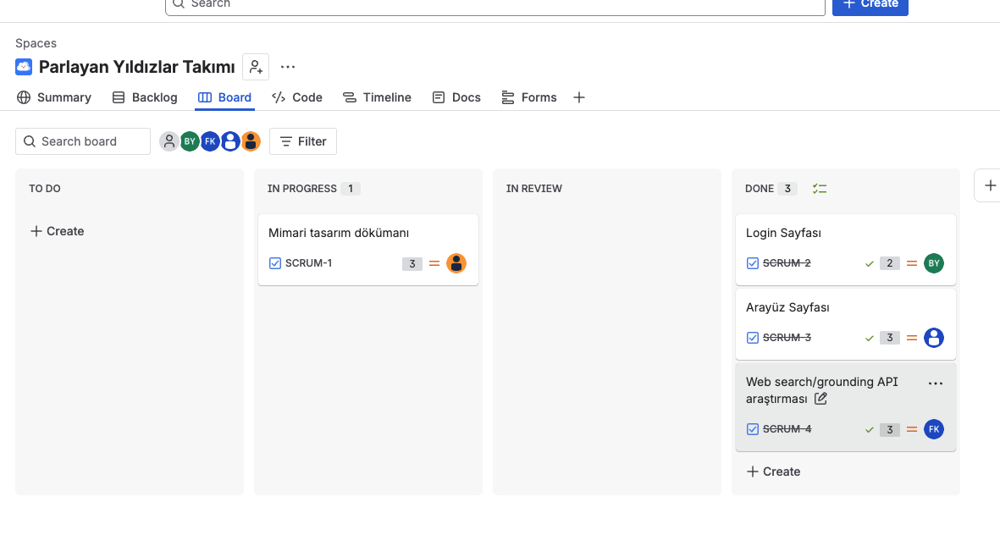

- **Ürün Durumu**: Ekran görüntüleri:

  Login sayfası:

  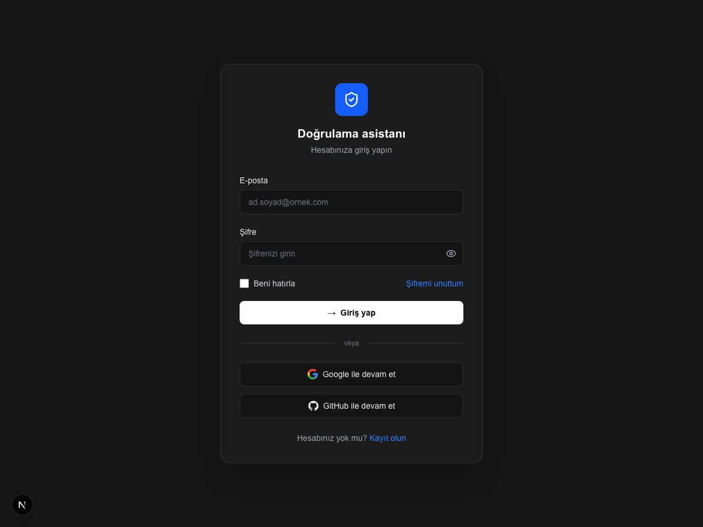

  Ana sayfa (iddia analiz ekranı):

  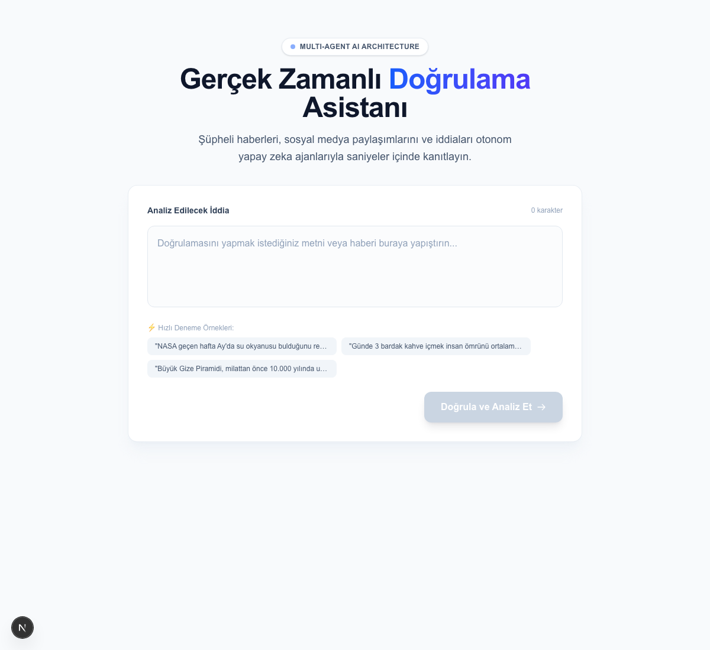

- **Sprint Review**: Sprint sonunda planlanan 11 puanın 8'i tamamlanmıştır. Login Sayfası (SCRUM-2: 2 puan), Arayüz Sayfası (SCRUM-3: 3 puan) ve Web search/grounding API araştırması (SCRUM-4: 3 puan) Done durumuna alınmış; ürünün login sayfası ile ana sayfası (iddia analiz ekranı) çalışır ve demoya hazır duruma getirilmiştir. Mimari tasarım dökümanı (SCRUM-1: 3 puan) sprint içinde tamamlanamamış olup bir sonraki sprint'e devredilmiştir. Bir sonraki sprint planlamasında bu iş; backlog'da bekleyen login ile arayüz sayfasının birleştirilmesi (SCRUM-5), database bağlanması (SCRUM-6) ve web tool'un arayüze entegrasyonu (SCRUM-7) story'leriyle birlikte ele alınacaktır. Sprint Review katılımcıları: Buket Yurt, Sude Özden., Sedef Ülker, Feyza İrem Kart. 

- **Sprint Retrospective**:
  - Daily Scrum'ların WhatsApp üzerinden asenkron yürütülmesinin ekibe uyduğuna ve devam etmesine karar verilmiştir.
  - UI değişikliklerinin commit'lenmeden önce takımla paylaşılıp geri bildirim alınması yaklaşımı benimsenmiştir.
  - Sprint'te tamamlanamayan mimari tasarım dökümanının puan tahmini gözden geçirilmeli ve sonraki sprint planlamasında ekip hızı dikkate alınmalıdır.
  - Bir sonraki sprint'te login ile arayüz sayfasının birleştirilmesine, database bağlantısına ve web tool entegrasyonuna öncelik verilecektir.

---

# Sprint 2

- **Sprint Notları**: Sprint 2, Sprint 1'in kapanışının ardından yürütülmüş ve ürünün uçtan uca çalışır hale getirilmesine odaklanmıştır. <!-- sprint adı ve tarih aralığını Jira'dan ekleyin --> Sprint hedefi; Sprint 1'den devreden mimari tasarım dökümanının tamamlanması, login sayfası ile arayüzün birleştirilip backend'e bağlanması, database kurulumu, register sayfası, web tool'un arayüze entegrasyonu ile logging altyapısının kurulmasıdır.

- **Sprint içinde tamamlanması tahmin edilen puan**: 21+ puan <!-- board görsellerinde görünmeyen 2 iş kaleminin puanlarıyla birlikte toplamı Jira'dan teyit edin -->

- **Puan tamamlama mantığı**: Sprint 1'den devreden iş ile ona bağımlı entegrasyon story'leri birlikte ele alınmıştır: Mimari tasarım dökümanı (SCRUM-1: 3 puan, devir), Login sayfası ile arayüz sayfasının birleştirilmesi (SCRUM-5: 1 puan), Database bağlanması (SCRUM-6: 3 puan), Web tool'un arayüze entegrasyonu (SCRUM-7: 5 puan), Login sayfasının backend'inin tamamlanması (SCRUM-8: 2 puan), Logging (SCRUM-10: 3 puan), Arayüzde sorulan soruların tablolarının mimarisi (SCRUM-11: 1 puan), Register sayfası (SCRUM-13: 3 puan). <!-- board'da görünmeyen 2 iş kalemini (numara, başlık, puan) buraya ekleyin -->

- **Backlog düzeni ve Story seçimleri**: Sprint 1 sonunda backlog'da bekletilen ve UI çıktıları hazır olduğu için önü açılan entegrasyon story'leri (SCRUM-5, SCRUM-6, SCRUM-7) Sprint 2'ye alınmış; bunlara kullanıcı yönetimini tamamlayan login backend'i ve register sayfası ile veri katmanı ve izlenebilirlik işleri (tablo mimarisi, logging) eklenmiştir.

- **Daily Scrum**: Daily Scrum toplantıları WhatsApp üzerinden asenkron yürütülmeye devam etmiştir. Sprint boyunca iki daily yapılmış; üyeler login/register'ın tamamlanması, PostgreSQL + Docker ile users, fact_check ve chats tablolarının oluşturulması, Gemini API ile soru-cevap akışının veritabanına kaydedilmesi, geçmiş analizler sayfası, logging ve admin tarafı ile Fact Check API kararı hakkında ilerlemelerini paylaşmıştır:

  **Daily 1**

  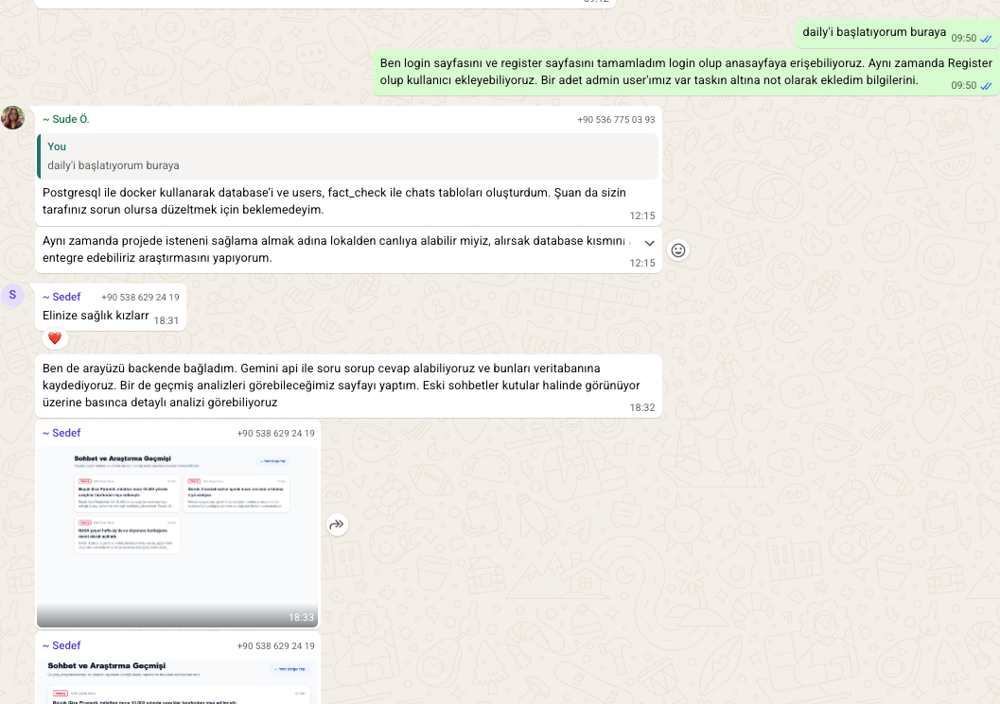
  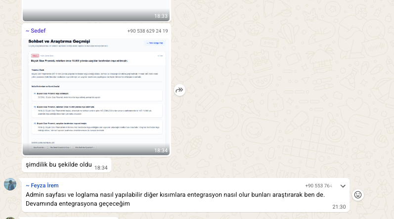

  **Daily 2**

  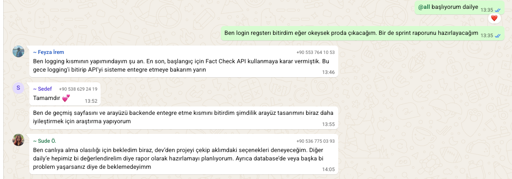

- **Sprint board update**: Sprint board ekran görüntüleri:

  Sprint devam ederken:

  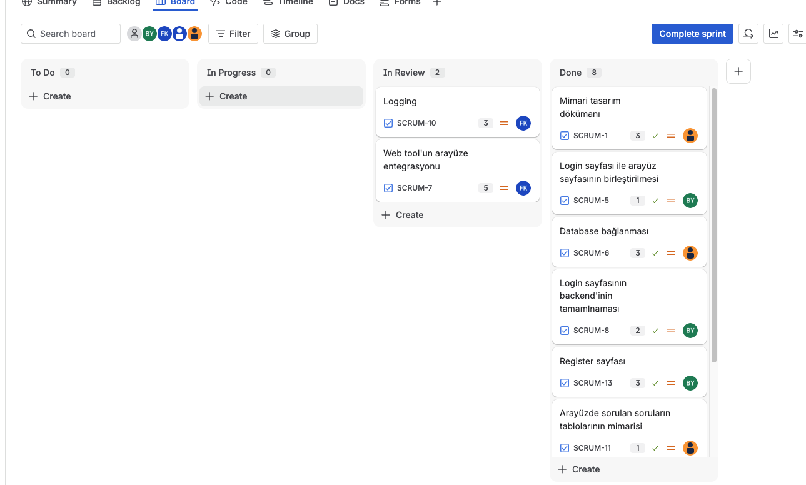

  Sprint sonu:

  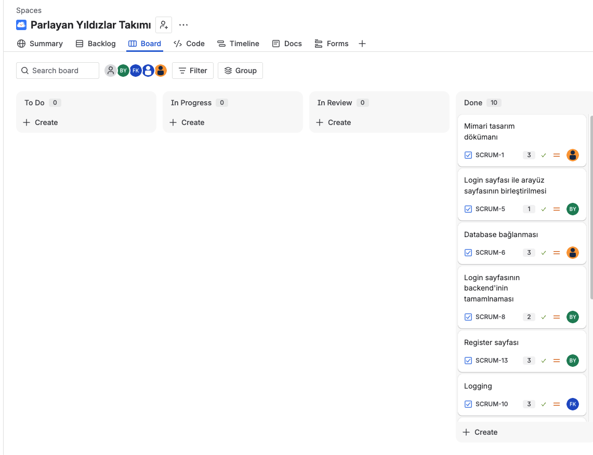

- **Ürün Durumu**: Ekran görüntüleri:

  Analiz sonucu ekranı (nihai karar, güven endeksi, doğrulama özeti ve kanıt analizi):

  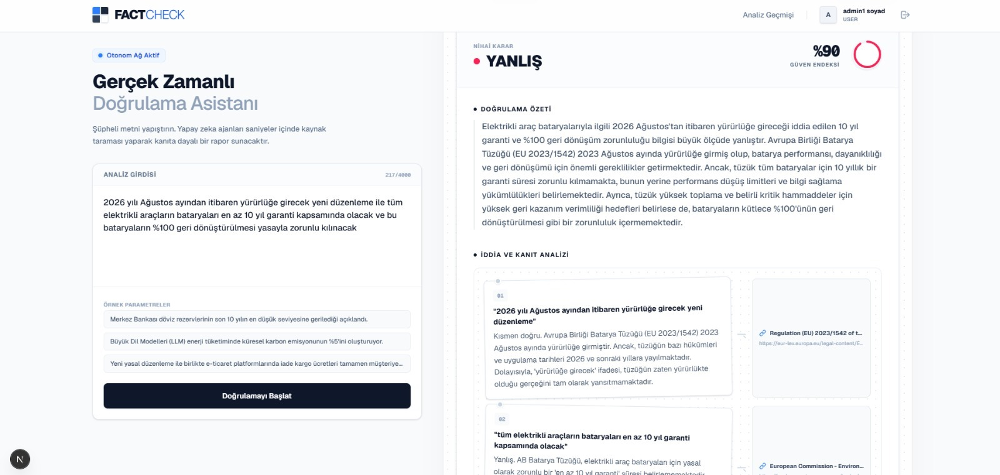

  Analiz sırasında ajan adımlarının canlı takibi (ayrıştırma, arama orkestrasyonu, çapraz doğrulama, sentez ve skorlama):

  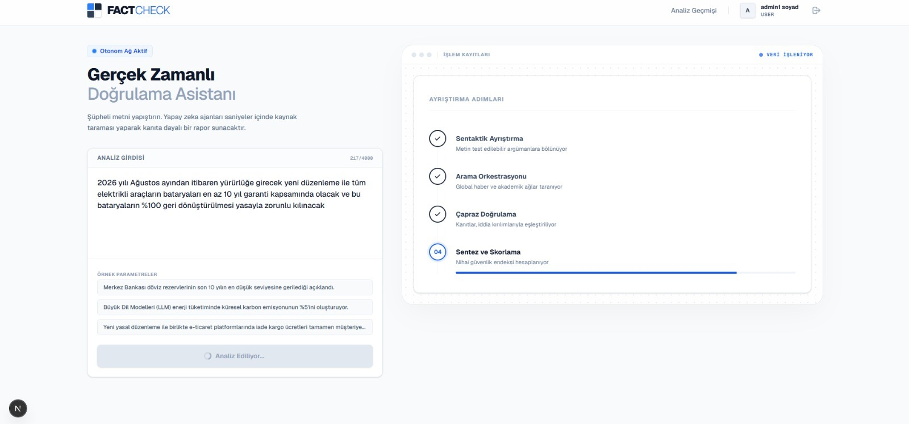

  Analiz Geçmişi sayfası (geçmiş doğrulama süreçleri ve raporları):

  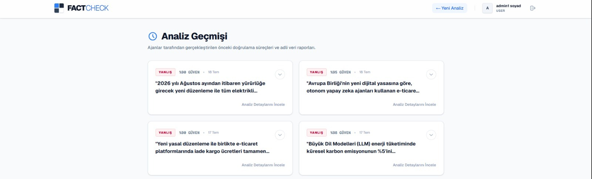

  Sprint içinde geliştirilen ilk sürümden geçmiş sayfası (Sohbet ve Araştırma Geçmişi — liste ve detay görünümü):

  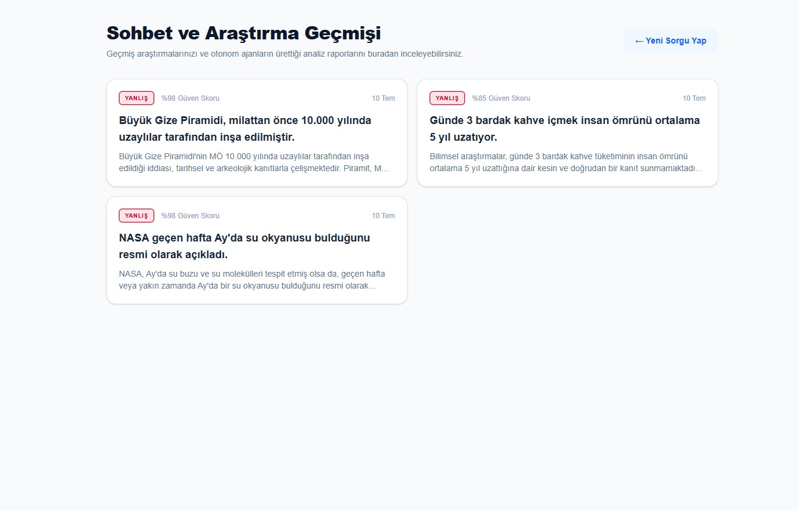
  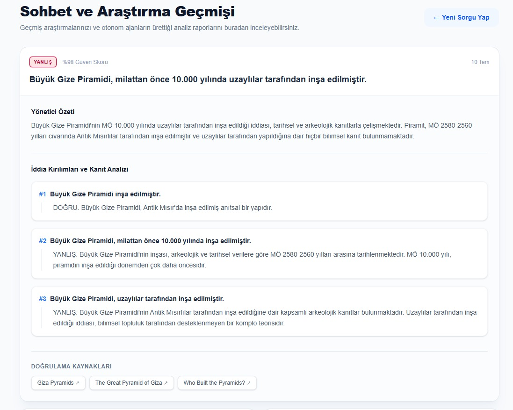

- **Sprint Review**: Sprint'e alınan iş kalemlerinin tamamı sprint sonunda Done durumuna alınmıştır. Sprint 1'den devreden mimari tasarım dökümanı tamamlanmış; login sayfası arayüzle birleştirilip backend'i yazılmış, register sayfası ile kullanıcı ekleme akışı kurulmuş ve bir admin kullanıcısı tanımlanmıştır. PostgreSQL + Docker ile database bağlanmış (users, fact_check, chats tabloları), arayüzde sorulan soruların tablo mimarisi kurulmuş ve Gemini API üzerinden soru-cevap akışı veritabanına kaydedilir hale getirilmiştir. Web tool olarak başlangıç için Fact Check API kullanımına karar verilmiş ve arayüze entegrasyonu ile logging altyapısı tamamlanmıştır. Geçmiş analizlerin görüntülenebildiği "Sohbet ve Araştırma Geçmişi" sayfası eklenmiştir. Canlıya alma (deployment) seçenekleri araştırılmaya başlanmış olup bir sonraki sprint'te ele alınacaktır. Sprint Review katılımcıları: Buket Yurt, Sude Özden, Sedef Ülker, Feyza İrem Kart.

- **Sprint Retrospective**:
  - Sprint'e birbirini bloklayan task'ların birlikte alınması nedeniyle sprint içinde bloklanmalar yaşanmıştır; sonraki sprint planlamalarında birbirine bağımlı task'ların aynı sprint'e alınmamasına veya sıralamasının buna göre planlanmasına dikkat edilmesine karar verilmiştir.
  - WhatsApp üzerinden asenkron daily formatının ekip için verimli olduğu teyit edilmiş ve sürdürülmesine karar verilmiştir.
  - Üyelerin işleri bittikçe diğer ekip arkadaşlarına destek için hazır beklemesi (ör. database tarafında) iyi işlemiştir; bu yaklaşım devam ettirilecektir.
  - Sprint kapanışlarının ekipçe değerlendirilebilmesi için sprint raporu hazırlanması kararlaştırılmıştır.
  - Bir sonraki sprint'te ürünün canlıya alınmasına (deployment) ve arayüz tasarım iyileştirmelerine öncelik verilecektir.
